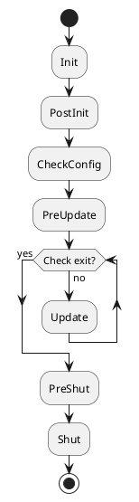

# Create a new module quickly

## A simple module

```cpp
#pragma once

#include "base/AFPluginManager.hpp"
#include "interface/AFIPlugin.hpp"
#include "interface/AFIModule.hpp"
#include "utility/interface/AFITimerModule.hpp"
#include "log/interface/AFILogModule.hpp"
#include "utility/interface/AFIScheduleModule.hpp"
#include "utility/interface/AFIGUIDModule.hpp"

namespace ark {

class Sample1Module final : public AFIModule
{
    ARK_DECLARE_MODULE_FUNCTIONS
public:
    bool Init() override;
    bool PostInit() override;
    bool Update() override;
    bool PreShut() override;
    bool Shut() override;

protected:
    AFITimerModule* m_pTimerModule;
    AFILogModule* m_pLogModule;
    AFIGUIDModule* m_pGUIDModule;
    AFIScheduleModule* m_pScheduleModule;
};

} // namespace ark
```

Explain:

- All modules inherits from `AFIModule`
- There are several conventional state machine execution functions in the module class.(Explain later)
- In addition to the variables that have their own logical functions, the main member variables of the module class are other module pointers, which are used to call the functions of other modules.(Please search **Interface oriented programming(IOP)**)

## Module execution state machine

As mentioned earlier, all of our modules are inherited from `AFIModule'. The AFIModule mainly contains the following virtual functions executed by plug-ins in different states, as follows

```cpp
#pragma once

#include "base/AFPlatform.hpp"
#include "base/AFMacros.hpp"

namespace ark {

class AFPluginManager;

class AFIModule
{
public:
    AFIModule() = default;
    virtual ~AFIModule() = default;

    virtual bool Init() { return true; }
    virtual bool PostInit() { return true; }
    virtual bool CheckConfig() { return true; }
    virtual bool PreUpdate() { return true; }
    virtual bool Update() { return true; }
    virtual bool PreShut() { return true; }
    virtual bool Shut() { return true; }

    virtual AFPluginManager* GetPluginManager() const { return nullptr; }

    virtual void SetPluginManager(AFPluginManager* p)
    {
        // Do nothing in the module interface
    }

    virtual const std::string& GetName() const
    {
        static const std::string null_str = "";
        return null_str;
    }

    virtual void SetName(const std::string& value)
    {
        // Do nothing in the module interface
    }
};

} // namespace ark
```

Module execution flowchart:

