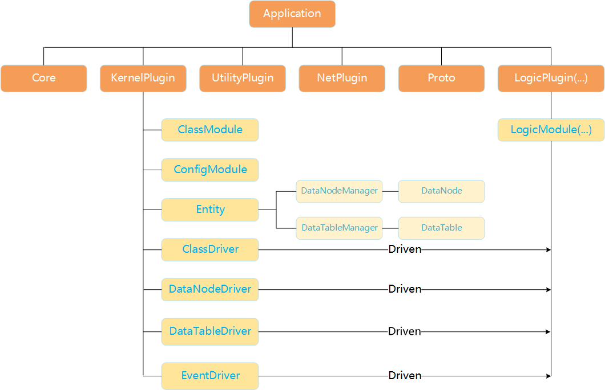

# 应用架构介绍

ARK中一个应用(application)是有插件(plugin)组成的, 插件(plugin)由很多模块(module)组成的, module通过面向接口编程(IOP)来做到功能调用.

这样做的好处有很多, 解耦、热插拔、模块独立、开发者关注更少、单一原则等等。

下图是ARk中应用的组成示例:

其中不同插件提供不同的功能, KernelPlugin主要来管理和驱动Entity实例的数据, 详情见[KernelPlugin介绍](/zh-cn/kernel-plugin.md).