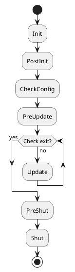

# 快速开发一个新模块

## 一个简单模块的搭建

```cpp
#pragma once

#include "base/AFPluginManager.hpp"
#include "interface/AFIPlugin.hpp"
#include "interface/AFIModule.hpp"
#include "utility/interface/AFITimerModule.hpp"
#include "log/interface/AFILogModule.hpp"
#include "utility/interface/AFIScheduleModule.hpp"
#include "utility/interface/AFIGUIDModule.hpp"

namespace ark {

class Sample1Module final : public AFIModule
{
    ARK_DECLARE_MODULE_FUNCTIONS
public:
    bool Init() override;
    bool PostInit() override;
    bool Update() override;
    bool PreShut() override;
    bool Shut() override;

protected:
    AFITimerModule* m_pTimerModule;
    AFILogModule* m_pLogModule;
    AFIGUIDModule* m_pGUIDModule;
    AFIScheduleModule* m_pScheduleModule;
};

} // namespace ark
```

说明:

- 所有的模块都继承自AFIModule
- 模块类中包含几个常规的状态机执行函数(稍后详细讲解)
- 模块类的成员变量除过自己逻辑功能的变量外, 主要成员变量为其他模块指针, 用来调用其他模块的功能(请自行搜索**面向接口编程IOP**)

## 模块执行状态机

前文提到, 我们所有的模块都继承自`AFIModule`, AFIModule中主要包含了如下几个插件在不同状态下执行的虚函数, 如下

```cpp
#pragma once

#include "base/AFPlatform.hpp"
#include "base/AFMacros.hpp"

namespace ark {

class AFPluginManager;

class AFIModule
{
public:
    AFIModule() = default;
    virtual ~AFIModule() = default;

    virtual bool Init() { return true; }
    virtual bool PostInit() { return true; }
    virtual bool CheckConfig() { return true; }
    virtual bool PreUpdate() { return true; }
    virtual bool Update() { return true; }
    virtual bool PreShut() { return true; }
    virtual bool Shut() { return true; }

    virtual AFPluginManager* GetPluginManager() const { return nullptr; }

    virtual void SetPluginManager(AFPluginManager* p)
    {
        // Do nothing in the module interface
    }

    virtual const std::string& GetName() const
    {
        static const std::string null_str = "";
        return null_str;
    }

    virtual void SetName(const std::string& value)
    {
        // Do nothing in the module interface
    }
};

} // namespace ark
```

模块执行流程图:

