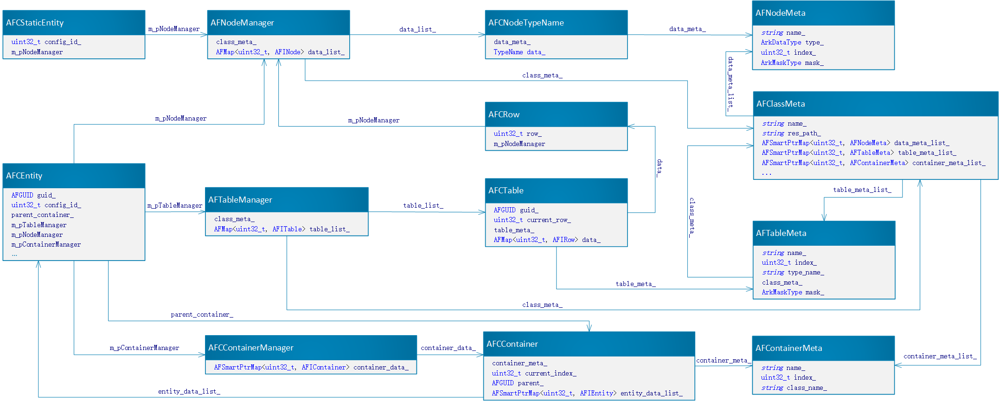

# 数据结构说明

`ARK` 使用数据和定义分离的策略 数据定义包含名字 其对应的下标 类型和是否存储等特征 数据实体包含一个指向对应定义的指针和具体的值 对象中属性用数据的下标和值的映射存储

## 数据配置生成

`ARK` 通过`bin/tools`文件夹下的工具`gen-config`把`bin/resource/excel`下的文件生成对应的数据定义文件和配置文件 分别放在`bin/resource/meta`和`bin/resource/server` 并且在`bin/resource/code`生成类的属性名和下标的接口

### 数据定义

有四个数据定义类

1. `AFNodeMeta` 对象的属性定义

- `name_` 属性名 `string`
- `type_` 类型 `enum class ArkDataType`
- `index_` 下标 `uint32`
- `mask_` 是否存储同步等特性 `std::bitset`

2. `AFTableMeta` 表结构定义

- `name_` 表名 `string`
- `index_` 下标 `uint32`
- `type_name_` 表对应的`AFClassMeta` 名称 `string`
- `class_meta_` 对应的`AFClassMeta` `ARK_SHARE_PTR<AFClassMeta>`
- `mask_` 是否存储同步等特性 `std::bitset`

3. `AFContainerMeta` 容器定义(用来存放对象 借以实现复杂数据结构)

- `name_` 容器名 `string`
- `index_` 下标 `uint32`
- `class_name_` 容器容纳的对象名 `string`

4. `AFClassMeta` 类结构定义

- `name_` 类名 `string`
- `res_path_` 资源路径 string
- `name_index_list_` 字段名和下表映射 `map`
- `data_meta_list_` 属性映射 `map`
- `table_meta_list_` 表映射 `map`
- `container_meta_list_` 容器映射 `map`
- `class_meta_call_back_` 函数回调 `pointer`

### 数据实体

数据实体有两个

1. `AFCStaticEntity` 配置数据实体类 对应接口类`AFIStaticEntity `

- `config_id_` 配置id `int` (因为配置id通用且需频繁访问 所以单独列出以提高访问效率)
- `m_pNodeManager` 属性管理器 `ARK_SHARE_PTR<AFNodeManager>`

2. `AFCEntity ` 对象实体类 对应接口类`AFIEntity `

- `guid_` 唯一编号 `AFGUID`
- `config_id_` 配置id `int`
- `parent_container_` 所属容器指针 `ARK_SHARE_PTR<AFIContainer>`
- `map_entity_id_` 地图实体id `int`
- `custom_data_list_` 自定义属性 `hashmap` (可以手动添加和删除属性 无需在文件中先定义好)
- `m_pNodeManager` 属性管理器 `ARK_SHARE_PTR<AFNodeManager>`
- `m_pTableManager` 表管理器 `ARK_SHARE_PTR<AFTableManager>`
- `m_pContainerManager` 容器管理器 `ARK_SHARE_PTR<AFIContainerManager>`
- `m_pEventManager` 事件管理器 `ARK_SHARE_PTR<AFIEventManager>`

其中用到的几个类如下

- `AFNodeManager` 属性管理类 用来管理对象的属性

  ```cpp
      using DataList = AFMap<uint32_t, AFINode>;
  
      // class meta
      ARK_SHARE_PTR<AFClassMeta> class_meta_{nullptr};
  
      // call back
      NODE_COMPONENT_FUNCTOR func_;
  
      // data list
      DataList data_list_;
  ```

- `AFTableManager` 表管理类 用来管理表 包括创建查找等操作

  ```cpp
      using TableList = AFMap<uint32_t, AFITable>;
  
      // class meta
      ARK_SHARE_PTR<AFClassMeta> class_meta_{nullptr};
  
      // table list
      TableList table_list_;
  ```

- `AFIContainerManager` 容器管理接口类 对应`AFCContainerManager` 用来管理容器 包括创建查找等操作

  ```cpp
      // container
      using ContainerList = AFSmartPtrMap<uint32_t, AFIContainer>;
      ContainerList container_data_;
  ```

- `AFIContainer` 容器接口类 对应`AFCContainer` 用于复杂结构 可以存放其它子对象

  ```cpp
      using EntityDataList = AFSmartPtrMap<uint32_t, AFIEntity>;
  
      // contain entity class meta
      ARK_SHARE_PTR<AFContainerMeta> container_meta_{nullptr};
  
      // index start
      uint32_t current_index_{0u};
  
      // parent id
      AFGUID parent_{NULL_GUID};
  
      // entity data
      EntityDataList entity_data_list_;
  ```

- `AFIEventManager` 事件管理类 处理对象的事件

- `AFINode` 属性接口类  对应`AFCNodeTypeName`(`TypeName`是基本类型名) 用来存放属性的值和对应的定义

  ```cpp
      // meta
      ARK_SHARE_PTR<AFNodeMeta> data_meta_{nullptr};
  
      // value
      TypeName data_{TypeName()};
  ```

- `AFITable` 表接口类 对应`AFCTable`

  ```cpp
      using TableData = AFMap<uint32_t, AFIRow>;
  
      // object unique guid
      AFGUID guid_{NULL_GUID};
  
      // table meta
      ARK_SHARE_PTR<AFTableMeta> table_meta_{nullptr};
  
      // current row
      uint32_t current_row{0u};
  
      // table data
      TableData data_;
  ```

- `AFIRow` 表行接口类 对应`AFCRow`

  ```cpp
      // row
      uint32_t row_{0u};
  
      // data
      ARK_SHARE_PTR<AFNodeManager> m_pNodeManager{nullptr};
  ```

### 结构图

